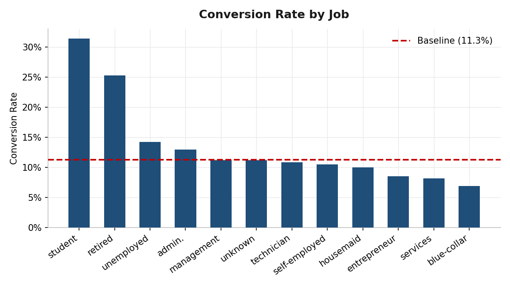
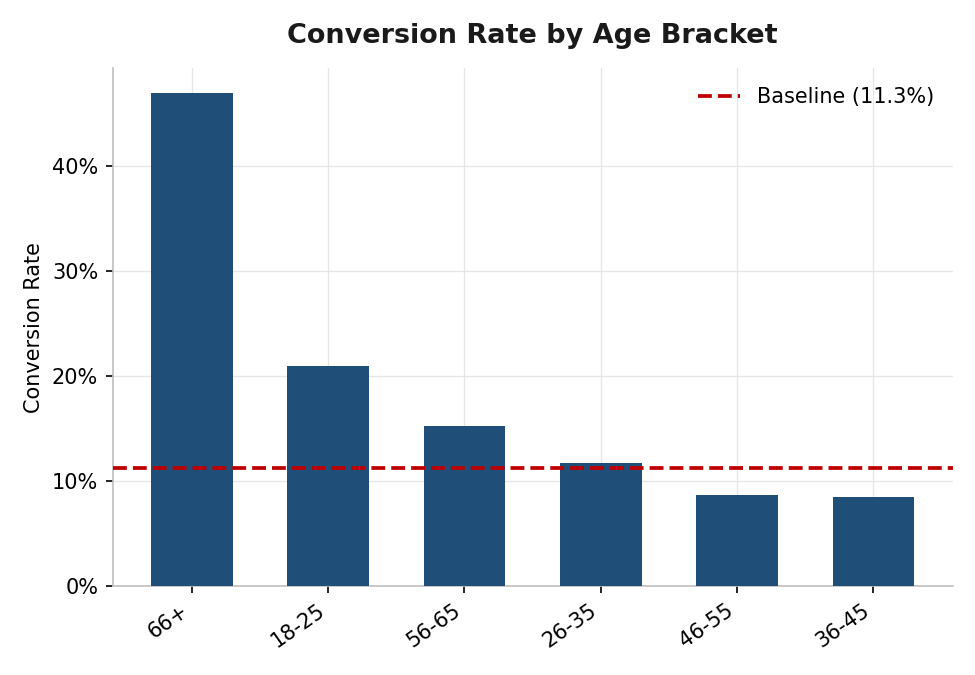
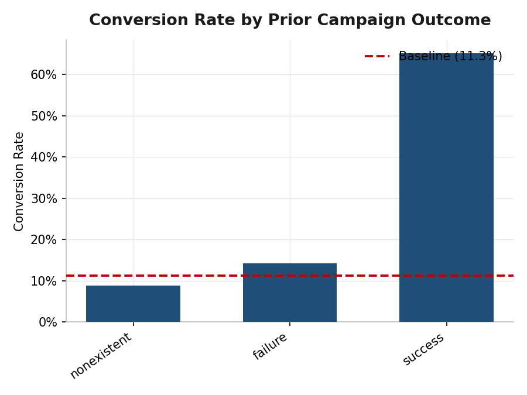
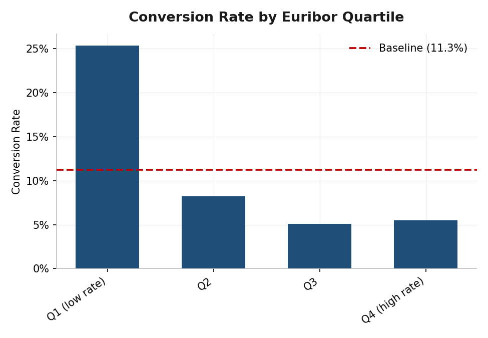
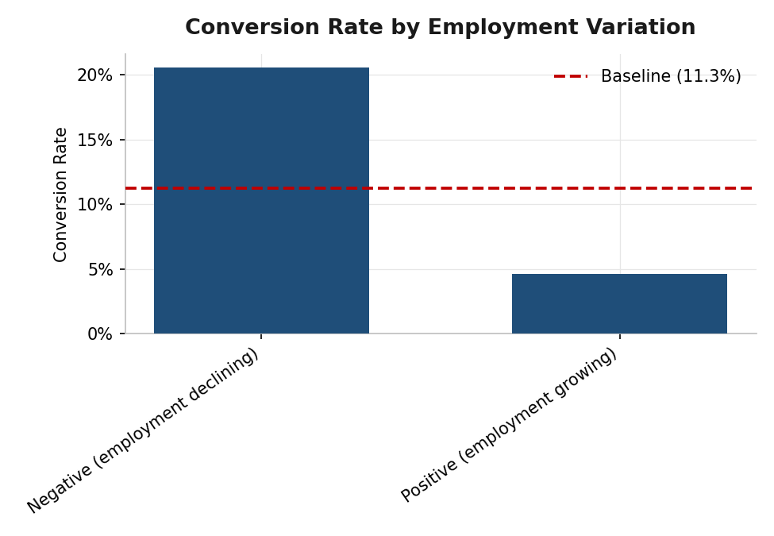
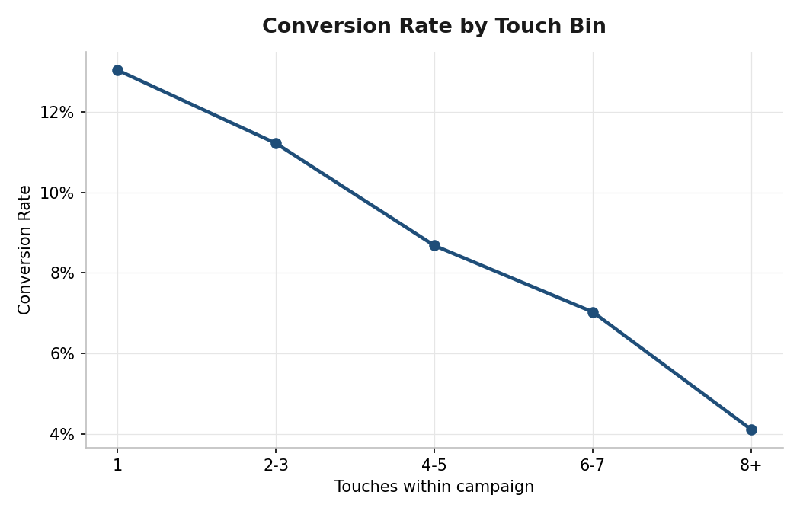

  <h1>Conversion Driver Analysis & Call Efficiency Optimization</h1>
  
<strong>Bank Term Deposit Campaign Targeting &nbsp;|&nbsp; 41,176 Contacts &nbsp;|&nbsp; Portuguese Retail Bank, 2008–2013</strong>

---

## Background

A Portuguese retail bank runs outbound telemarketing campaigns, calling its own customers to sell term deposits — a fixed-term, fixed-rate savings product similar to what's called a CD (Certificate of Deposit) in the US. Every call costs the bank agent time and phone infrastructure, but conversion rates vary widely depending on who is called, how many times they're called, and what's happening in the broader economy at the time. The bank has no systematic way to tell, in advance, which calls are worth making.

The central question: **who should get called, how many times, and does it matter when?**

---

## Executive Summary

Across 41,176 telemarketing contacts, overall conversion sits at **11.27%**. That average hides a much sharper reality: three factors — life-stage, prior contact history, and call effort — each independently predict conversion far above or below that baseline, and they compound. Customers who are both in a high-converting life-stage group *and* have prior contact history convert at **44.3%**, nearly 4x baseline, while a customer with neither converts at just 7.99%.

Capping outreach at 3 attempts per lead would eliminate 18.5% of total call volume while forgoing only 12.0% of conversions — an estimated **$38,170** in call center savings at a cited industry cost-per-call figure. Economic conditions at time of contact also matter: conversion was markedly higher during weaker-economy periods, which turned out to explain an initially puzzling gap between contact channels rather than the channel itself being the driver.

> 📊 **Interactive Tableau dashboard — coming soon**

---

## Methodology

The raw source is a single flat CSV (~41K rows, one row per contact attempt). It was remodeled into a **star schema** — a skinny `fact_contacts` table (the outcome + foreign keys) surrounded by three dimension tables — rather than analyzed flat, so that repeated attribute values (job, economic indicators) aren't duplicated across tens of thousands of rows and segment/efficiency queries stay simple joins instead of repeated `CASE` logic.

| Table | Grain | Notes |
|---|---|---|
| `fact_contacts` | One row per contact attempt | Outcome, touch count, month/day, `duration` flagged benchmark-only |
| `dim_customer_profile` | One row per unique demographic combination | Not a real customer master — the source has no customer ID, so this is a deduplicated profile lookup, not tracked individuals |
| `dim_campaign` | One row per unique (contact type, prior outcome, days since last contact, prior contact count) combination | |
| `dim_economic_context` | One row per unique economic snapshot | Keyed independently of `month`, since the source has no year and economic snapshots don't align 1:1 with month labels |

**Pipeline:** raw CSV → Python (`pandas`) ETL builds the star schema → loaded as Delta Lake tables in Databricks (Community Edition) → SQL analysis and reusable views → findings exported to Excel for supporting visuals → Tableau dashboard connected live to Databricks (in progress).

---

## The Business Problem

The bank's 11.27% conversion rate is not evenly distributed — it concentrates in specific life-stage segments, specific contact histories, and specific windows of economic conditions. That concentration is what makes the problem fixable: it isn't random, it's structural.

| Contact History | Contacts | Conversion Rate |
|---|---|---|
| Never contacted before (`nonexistent`) | 35,551 | **8.8%** |
| Previously contacted, said no (`failure`) | 4,252 | 14.2% |
| Previously contacted, said yes (`success`) | 1,373 | **65.1%** |

- **Business implication:** The bank is spending the overwhelming majority of its call volume (86% of contacts) on customers with no contact history at all — the segment that converts worst. Prior relationship, of any kind, is the single strongest signal in the dataset.

---

## Who Is Converting?

Four customer-profile cuts — job, education, marital status, and age bracket — were tested, and three of them collapse into the same underlying pattern rather than acting as independent signals.

| Segment | Conversion Rate | vs. Baseline |
|---|---|---|
| Age 66+ | **46.9%** | 4.2x |
| Student (job) | 31.4% | 2.8x |
| Retired (job) | 25.3% | 2.2x |
| Age 18-25 | 20.9% | 1.9x |
| Blue-collar (job) | 6.9% | 0.6x |

**80%+ of the highest-converting contacts sit at the two age extremes.** Students, retirees, and the 18-25/66+ age brackets all point at the same life-stage population, while the core working-age, blue-collar/services group — the majority of total call volume — converts below baseline. Marital status was a weak standalone signal and education largely echoed the job/age pattern rather than adding new information.

- **Business implication:** The bank's current call volume is weighted toward the group least likely to convert. Reallocating effort toward the life-stage extremes, without spending a single additional dollar, would raise average conversion without any change in total calls made.

---

## What Is Driving Conversion, Beyond Who's Called?

### Prior Contact History — The Strongest Single Signal in the Dataset

A customer with a prior campaign success converts at 65.1%; a prior *failure* still converts at 14.2% — nearly double baseline. Only customers with no history at all (`nonexistent`) sit below baseline, at 8.8%.

- **Business implication:** A past "no" is not a reason to stop calling someone. Any prior relationship with the bank, positive or negative, outperforms a cold contact by a wide margin.

### Economic Conditions — Conversion Rises When the Economy Weakens

| Economic Indicator | Condition | Conversion Rate |
|---|---|---|
| Euribor 3-month rate | Lowest quartile | **25.4%** |
| Euribor 3-month rate | Other three quartiles | 5.1%–8.3% |
| Employment variation | Declining | **20.6%** |
| Employment variation | Growing | 4.6% |

Conversion was dramatically higher during economically weaker stretches of the campaign — both indicators move together, since low interest rates and declining employment are two symptoms of the same underlying economic period (2008–2013 spans a financial crisis and its recovery), not two independent confirmations.

This also resolved an earlier puzzle: raw conversion looked very different by contact channel (cellular 14.7% vs. telephone 5.2%), but the two channels were used under measurably different average economic conditions. The channel gap is very likely explained by *when* each channel was used, not the channel itself — so `contact_type` was **not** used as a targeting rule. Consumer confidence index, by contrast, showed no clean trend and also wasn't used.

- **Business implication:** Campaign *timing* is a real, usable lever — independent of who gets called, the same target list converts better if the campaign runs during a weaker economic stretch.

### Call Effort — Diminishing Returns After 3 Touches

Conversion rate declines steadily with each additional contact attempt: 13.0% on the first call, down to 4.3% by the eighth. Converted contacts average 2.05 touches vs. 2.63 for non-converted contacts — the people who say yes tend to say it early.

| Metric | Value |
|---|---|
| Call volume eliminated by capping at 3 touches | 18.5% (7,634 of 41,176 calls) |
| Conversions forgone | 12.0% (555 of 4,639) |
| Cost per call (cited industry estimate) | $5 |
| **Estimated cost savings** | **$38,170** |

*$5/call is a cited industry estimate, not derived from this dataset. Source: [Voiso, "Call Center Cost Per Call"](https://voiso.com/articles/call-center-cost-per-call/).*

- **Business implication:** This pattern held evenly across nearly every segment — it isn't something that needs to be customized by customer type, it's a rule that can be applied bank-wide.

---

## The Profile Behind 44% Conversion

The drivers above are not independent — they compound.

| Life-Stage Priority Segment | Prior Contact History | Conversion Rate | Contacts |
|---|---|---|---|
| No | No | 8.0% | 32,549 |
| No | Yes | 23.3% | 4,738 |
| Yes | No | 18.0% | 3,002 |
| **Yes** | **Yes** | **44.3%** | 887 |

*"Life-stage priority segment" = student or retired (job), or age 18-25 / 66+.*

A customer who is both in a priority life-stage group **and** has prior contact history converts at 44.3% — nearly 4x baseline (8.0%) — while a priority life-stage customer with no prior contact converts at a much more modest 18.0%. Life-stage alone is a meaningful signal, but it's substantially amplified by contact history.

- **Business implication:** The highest-value targeting rule isn't "call students and retirees" or "call people with contact history" in isolation — it's the overlap of both. That overlap is a small slice of total volume (887 of 41,176 contacts, ~2%) but converts at nearly half the time.

---

## Recommendations

### 1 — Prioritize by Life-Stage and Prior Contact History Together

*Targets: the compound profile above. Highest-leverage segment converts at 44.3% vs. 8.0% baseline.*

Build the target list around the overlap, not either factor alone: students, retirees, and customers aged 18-25 or 66+, cross-referenced against anyone with any prior campaign contact.

### 2 — Cap Outreach at 3 Attempts Per Lead

*Targets: call-effort finding. Est. impact: 18.5% fewer calls, 12.0% fewer conversions, ~$38,170 saved.*

Conversion drops off sharply and consistently after the third attempt, and the pattern held bank-wide across segments — this is a uniform policy, not a per-segment exception.

### 3 — Treat Economic Conditions as a Campaign-Timing Decision

*Targets: economic-sensitivity finding. Conversion was 3–5x higher during weaker-economy windows.*

Not a per-customer filter — a scheduling input. Where possible, weight future campaign launches toward periods of lower interest rates / weaker employment growth.

### 4 — Do Not Use Contact Channel as a Targeting Rule

*Targets: the resolved contact_type confound.*

The apparent cellular-vs-telephone gap is very likely explained by the economic-timing finding above, not the channel itself.

---

## Putting It Together

The bank does not have a broadly low-converting customer base — it has a concentrated one. A small, identifiable slice of customers (life-stage extremes with prior contact history) convert at nearly half the time, while the majority of current call volume goes to a segment converting under 8%. None of the four recommendations require new technology or additional headcount — they require changing who gets called first, how many times, and roughly when.

---

## Dataset

| Field | Detail |
|---|---|
| Source | UCI Machine Learning Repository — Bank Marketing (`bank-additional-full`), Moro, Cortez & Rita (2014) |
| Rows | 41,176 contacts (12 exact duplicate rows dropped from the original 41,188) |
| Scope | Client demographics, campaign contact history, social/economic context indicators |
| Target variable | `y` / `converted` — Yes/No (11.27% overall, 4,639 of 41,176) |

**Known data considerations:**
- `duration` (last call length) is excluded from all targeting/predictive logic — it's only known after a call happens, and a duration of 0 always means no real contact occurred, making it a leakage trap if used as a feature.
- No real dollar cost-per-call or deposit-value data exists in this dataset. The $5/call figure used above is an explicitly stated, cited external assumption, not a data-derived fact.
- `month`/`day_of_week` exist but no year is present in the source file, so no true calendar-date dimension could be built; economic-condition snapshots were used as the time-aware signal instead.

---

## Project Files

| File | Description |
|---|---|
| `etl/build_star_schema.py` | Builds the star schema (`fact_contacts` + 3 dimension tables) from the raw CSV |
| `notebooks/01_segment_conversion_analysis.sql` | Databricks SQL notebook source — segment conversion + baseline |
| `notebooks/Conversion_EDA.ipynb` | Full EDA notebook export — all SQL, narrative, and result tables |
| `excel/bank_marketing_findings.xlsx` | Excel workbook — data tables + native charts behind every finding above |
| `excel/build_visuals.py`, `excel/build_readme_images.py` | Scripts that generate the Excel workbook and README chart images |
| `images/*.png` | Chart images embedded in this README |

## Tools

- **SQL** — Databricks (Delta Lake) for the star schema and all segment/efficiency/economic-sensitivity analysis
- **Python (pandas)** — initial ETL and schema design
- **Excel (openpyxl)** — supporting visuals and data tables
- **Tableau** — interactive dashboard (in progress), connected directly to Databricks via the native connector

## Next Steps & Limitations

- No real dollar cost/value data — all financial framing depends on the disclosed $5/call assumption, not data-derived figures
- Economic context fields are period-level indicators, not customer-specific, so their effect is at the campaign-timing level, not the individual level
- Future extension: a simple classification model (logistic regression) excluding `duration`, evaluated on precision/recall given class imbalance, to complement the rule-based segmentation with a predictive layer
